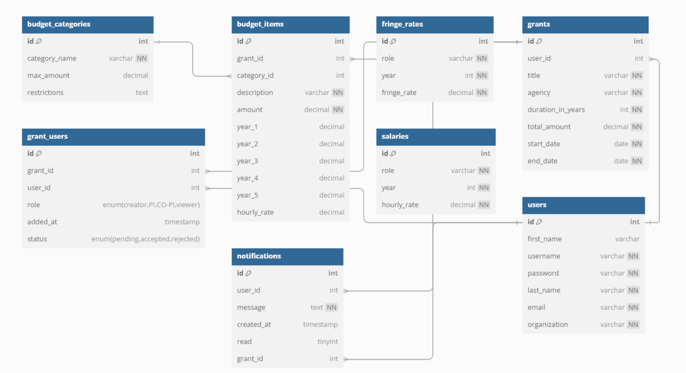

# Grant Budget Management System (GBMS)

The **Grant Budget Management System (GBMS)** is a web-based application designed to assist researchers, administrators, and grant managers in creating and managing grant budgets. The system streamlines the budgeting process, tracks personnel costs, and calculates direct and indirect costs efficiently.

### Live Demo
Access the live application [here](https://gbms-v2-2a5c07812841.herokuapp.com/login.php).

---

## Features

- **User Authentication**: Secure login and registration system.
- **Grant Management**:
  - Create and manage grant budgets.
  - Assign roles to team members (PI, Co-PI, etc.).
- **Dynamic Budget Calculation**:
  - Calculate yearly and total costs dynamically.
  - Integrate fringe and indirect cost calculations.
- **Excel Export**: Download grant budgets as well-formatted Excel sheets.
- **Responsive Design**: Accessible on desktop and mobile devices.

---

## Technologies Used

### Programming Languages
- **Frontend**: HTML, CSS, JavaScript
- **Backend**: PHP (>=8.0)

### Database
- **MySQL**: Used for storing user data, grant details, and budgeting information.
- **JawsDB**: Cloud-hosted MySQL database for Heroku deployment.

### Tools and Frameworks
- **PhpSpreadsheet**: For generating downloadable Excel files with budget details.
- **Dotenv**: For managing environment variables in local development.
- **Composer**: For dependency management in PHP.
- **Heroku**: For hosting the application.

---

## Database Schema

### **Users Table**
The **Users** table serves as the backbone of the system, storing critical user data for authentication and role management. Each user has attributes like:
- **Unique username and email** for login and identification.
- **Organization affiliation**, which can help manage grants across multiple institutions.
- Integration with other tables ensures seamless role assignment (e.g., PI, Co-PI, or viewer) for various grants through the `grant_users` table.

This table highlights how the system supports a multi-user environment for collaborative grant management.

---

### **Grants Table**
The **Grants** table captures vital information about grants, making it a central hub for managing research projects. Key details include:
- **Funding agency information** (e.g., NSF, NIH) to identify the source of the grant.
- **Duration and financial data** to manage long-term projects.
- Direct relationships with users (through the `user_id`) and budget items ensure tight integration of administrative, financial, and operational data.

This table showcases how the project accommodates comprehensive grant tracking.

---

### **Budget Items Table**
The **Budget Items** table is a granular tracker of financial allocations within grants. Highlights include:
- Tracking **multi-year budgets** across up to six years.
- Attributes like **description, amount, and hourly rate**, ensuring precise financial records.
- Relationships with the **Grants** and **Budget Categories** tables enable categorization and contextualization of spending.

This table emphasizes the system's ability to handle complex financial data in detail.

---

### **Budget Categories Table**
The **Budget Categories** table defines and enforces the structure of the budget. It provides:
- **Predefined categories** (e.g., Personnel Compensation, Equipment, Travel) that align with funding agency requirements.
- **Restrictions** to ensure compliance with grant rules, such as limits on equipment spending.

This table simplifies grant budgeting by providing clear frameworks for categorization.

---

### **Fringe Rates Table**
The **Fringe Rates** table is an auxiliary but important component for calculating personnel costs. It includes:
- **Role-specific rates** (e.g., Faculty, GRAs) to standardize cost projections.
- Multi-year rates to align with the duration of grants.

This table demonstrates the system's ability to support accurate financial forecasting.

---

### **Grant Users Table**
The **Grant Users** table links users to grants with specific roles (e.g., creator, PI, Co-PI, or viewer). Key attributes include:
- **Role assignment**, which dictates user permissions.
- **Status tracking** (e.g., pending, accepted, rejected) to manage collaboration.

This table highlights the system's collaborative nature and robust access control mechanisms.

---

### **Notifications Table**
The **Notifications** table adds a dynamic layer of communication, allowing users to:
- Receive updates about their grants, such as invitations or role changes.
- Track notification statuses (e.g., read or unread) for follow-up actions.

This table enhances usability by keeping users informed about project developments.

---

### **Salaries Table**
The **Salaries** table provides a standardized reference for personnel compensation. Key features include:
- **Role-specific hourly rates** for budgeting personnel costs.
- Multi-year data to handle grant durations effectively.

This table supports transparent and consistent budgeting for human resources.

---

### **Key Highlights**
- **Centralized Grant Management**: The `Grants` table connects users, budgets, and notifications, ensuring a streamlined workflow.
- **Comprehensive Budget Tracking**: The combination of `Budget Items` and `Budget Categories` tables ensures that every dollar is categorized and tracked accurately.
- **Collaborative Environment**: The `Grant Users` table enables multi-role assignments, allowing diverse teams to collaborate effectively.
- **Dynamic and Scalable**: The modular design, with auxiliary tables like `Fringe Rates` and `Salaries`, ensures the system can adapt to complex funding requirements.


### Here's my Entity-Relationship Model for this project:


More details about database can be found in [grant_budget.sql](https://github.com/dristanta-silwal/grant-budget-management-system/blob/main/grant_budget.sql).


---

## Getting Started

### Prerequisites

- PHP (>=8.0)
- Composer
- MySQL
- Git

### Installation

1. Clone the repository:
   ```bash
   git clone https://github.com/dristanta-silwal/grant-budget-management-system
   cd grant-budget-management-system
   ```

2. Install dependencies:
   ```bash
   composer install
   ```

3. Configure environment variables:
   - Create a `.env` file in the root directory with the following:
     ```plaintext
     DB_HOST=localhost
     DB_USERNAME=your_username
     DB_PASSWORD=your_password
     DB_DATABASE=your_database
     DB_PORT=3306
     ```

4. Set up the database:
   - Import the provided SQL schema into your MySQL database:
     ```bash
     mysql -u your_username -p your_database < grant_budget.sql
     ```

5. Run the application locally:
   ```bash
   php -S localhost:8000
   ```

6. Access the application:
   - Open your browser and navigate to `http://localhost:8000`.

---

## Deployment on Heroku

1. Install the Heroku CLI and log in:
   ```bash
   heroku login
   ```

2. Create a Heroku app and add JawsDB:
   ```bash
   heroku create
   heroku addons:create jawsdb
   ```

3. Push your code to Heroku:
   ```bash
   git push heroku main
   ```

4. Access your application using the Heroku-provided URL.

---

## Usage

1. **Login/Register**: Start by creating an account or logging in.
2. **Manage Grants**:
   - Add new grants with details like title, agency, and duration.
   - Assign personnel roles and calculate costs dynamically.
3. **Export Data**:
   - Download the budget as an Excel file for offline use.

---

## Screenshots

### Login Page


### Register Page


### Budget Management Dashboard


### Notifications


### Create Grant


### Manage People


### Manage Budget


### Generated default Excel file
[Click Here to View](assets/gbms_excel.pdf)


---

## Running the Project

### Locally
Follow the [installation steps](#installation) to set up the project on your local machine.

### On Heroku
Access the live application at the [live demo link](https://gbms-v2-2a5c07812841.herokuapp.com/login.php).

---

## Contributing

Contributions are welcome! To contribute:

1. Fork the repository.
2. Create a new branch:
   ```bash
   git checkout -b feature-name
   ```
3. Make your changes and commit them:
   ```bash
   git commit -m "Add feature-name"
   ```
4. Push to your branch:
   ```bash
   git push origin feature-name
   ```
5. Submit a pull request.

---

## License

This project is licensed under the MIT License.

---

## Contact

For any inquiries or feedback, please contact [Dristanta Silwal](https://dristantasilwal.com.np/) at dristantasilwal003@gmail.com.
