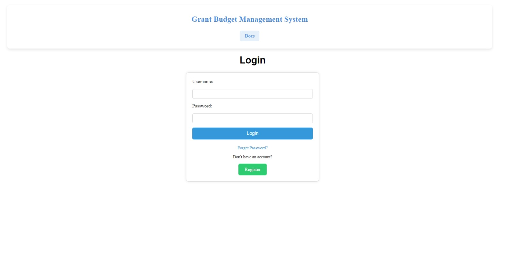
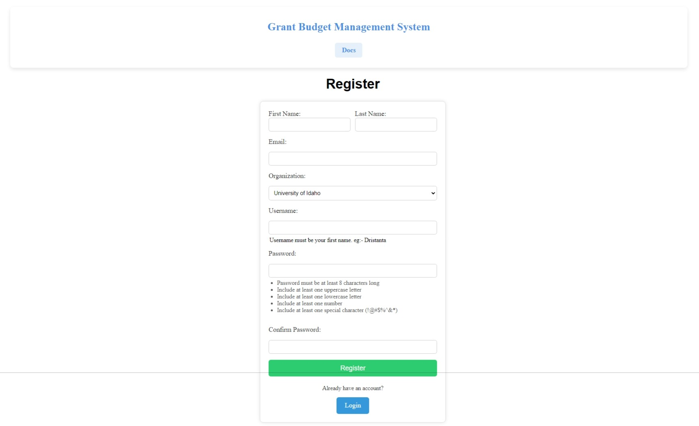
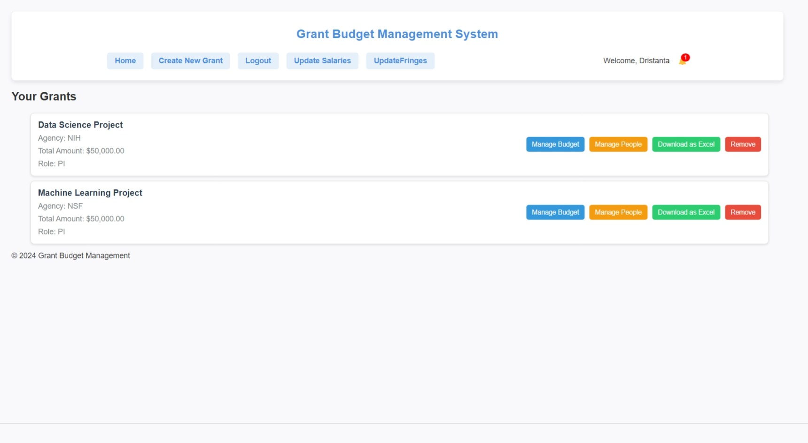
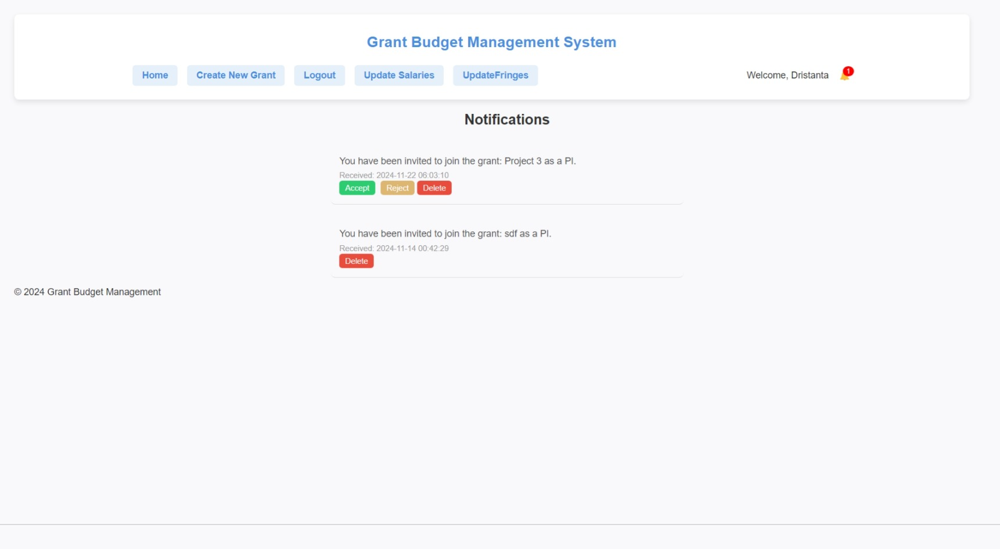
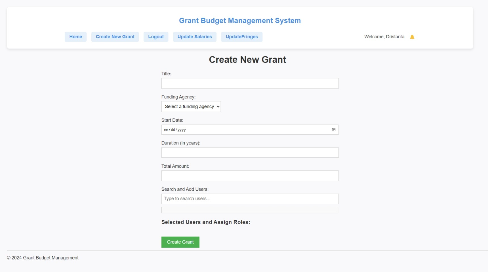
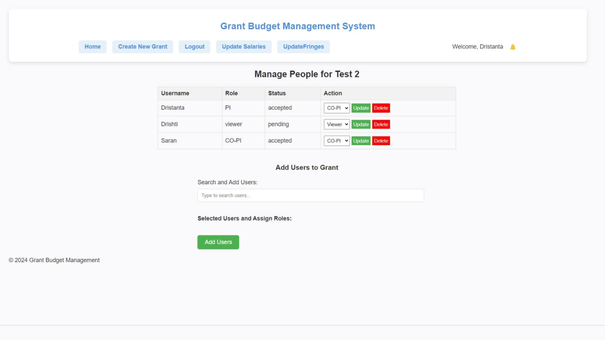
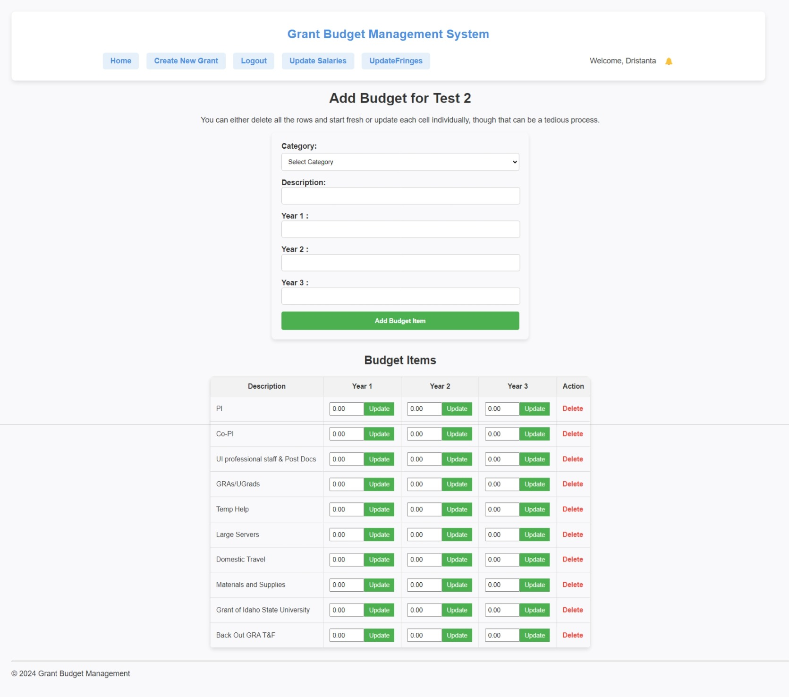

# Grant Budget Management System (GBMS)

The **Grant Budget Management System (GBMS)** is a web-based application designed to assist researchers, administrators, and grant managers in creating and managing grant budgets. The system streamlines the budgeting process, tracks personnel costs, and calculates direct and indirect costs efficiently.

### Live Demo
Access the live application [here](https://gbms-v2-2a5c07812841.herokuapp.com/login.php).

---

## Features

- **User Authentication**: Secure login and registration system.
- **Grant Management**:
  - Create and manage grant budgets.
  - Assign roles to team members (PI, Co-PI, etc.).
- **Dynamic Budget Calculation**:
  - Calculate yearly and total costs dynamically.
  - Integrate fringe and indirect cost calculations.
- **Excel Export**: Download grant budgets as well-formatted Excel sheets.
- **Responsive Design**: Accessible on desktop and mobile devices.

---

## Technologies Used

### Programming Languages
- **Frontend**: HTML, CSS, JavaScript
- **Backend**: PHP (>=8.0)

### Database
- **MySQL**: Used for storing user data, grant details, and budgeting information.
- **JawsDB**: Cloud-hosted MySQL database for Heroku deployment.

### Tools and Frameworks
- **PhpSpreadsheet**: For generating downloadable Excel files with budget details.
- **Dotenv**: For managing environment variables in local development.
- **Composer**: For dependency management in PHP.
- **Heroku**: For hosting the application.

---

## Database Schema

### Users Table
Stores user information for authentication and role assignments.

### Grants Table
Stores information about grants.

### Budget Items Table
Tracks budgeting details for grants.

### Budget Categories Table
Defines categories for budget items.

More details about database can be found in [grant_budget.sql](https://github.com/dristanta-silwal/grant-budget-management-system/blob/main/grant_budget.sql).


---

## Getting Started

### Prerequisites

- PHP (>=8.0)
- Composer
- MySQL
- Git

### Installation

1. Clone the repository:
   ```bash
   git clone https://github.com/dristanta-silwal/grant-budget-management-system
   cd grant-budget-management-system
   ```

2. Install dependencies:
   ```bash
   composer install
   ```

3. Configure environment variables:
   - Create a `.env` file in the root directory with the following:
     ```plaintext
     DB_HOST=localhost
     DB_USERNAME=your_username
     DB_PASSWORD=your_password
     DB_DATABASE=your_database
     DB_PORT=3306
     ```

4. Set up the database:
   - Import the provided SQL schema into your MySQL database:
     ```bash
     mysql -u your_username -p your_database < grant_budget.sql
     ```

5. Run the application locally:
   ```bash
   php -S localhost:8000
   ```

6. Access the application:
   - Open your browser and navigate to `http://localhost:8000`.

---

## Deployment on Heroku

1. Install the Heroku CLI and log in:
   ```bash
   heroku login
   ```

2. Create a Heroku app and add JawsDB:
   ```bash
   heroku create
   heroku addons:create jawsdb
   ```

3. Push your code to Heroku:
   ```bash
   git push heroku main
   ```

4. Access your application using the Heroku-provided URL.

---

## Usage

1. **Login/Register**: Start by creating an account or logging in.
2. **Manage Grants**:
   - Add new grants with details like title, agency, and duration.
   - Assign personnel roles and calculate costs dynamically.
3. **Export Data**:
   - Download the budget as an Excel file for offline use.

---

## Screenshots

### Login Page


### Register Page


### Budget Management Dashboard


### Notifications


### Create Grant


### Manage People


### Manage Budget


### Generated default Excel file
[Click Here to View](assets/gbms_excel.pdf)


---

## Running the Project

### Locally
Follow the [installation steps](#installation) to set up the project on your local machine.

### On Heroku
Access the live application at the [live demo link](https://gbms-v2-2a5c07812841.herokuapp.com/login.php).

---

## Contributing

Contributions are welcome! To contribute:

1. Fork the repository.
2. Create a new branch:
   ```bash
   git checkout -b feature-name
   ```
3. Make your changes and commit them:
   ```bash
   git commit -m "Add feature-name"
   ```
4. Push to your branch:
   ```bash
   git push origin feature-name
   ```
5. Submit a pull request.

---

## License

This project is licensed under the MIT License.

---

## Contact

For any inquiries or feedback, please contact [Dristanta Silwal](https://dristantasilwal.com.np/) at dristantasilwal003@gmail.com.
